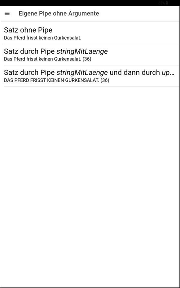
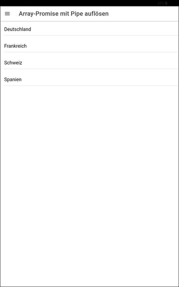

# Ionic-App "Pipe-Demo" #

 

Simple [Ionic](https://ionicframework.com) app to demonstrate the usage of [pipes](https://angular.io/guide/pipes).

 

----

## Screenshots ##

 

   
   
   

 

----

## Run the app locally ##

 

Prerequisite: NPM package [`@ionic/cli`](https://www.npmjs.com/package/@ionic/cli) must be installed globally.

 

**Steps:**

1. Clone the repository.

2. Open shell in root folder of cloned repository and execute `npm install`.

3. To run app locall in browser execute `ionic serve`.

 

----

## License ##

 

See the [LICENSE file](LICENSE.md) for license rights and limitations (BSD 3-Clause License) for the files in this repository.

 
 
